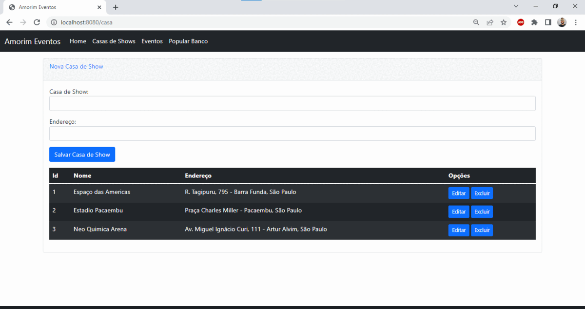

# Projeto-MVC-Gerenciador-De-Eventos

## Gerenciador de Eventos

O projeto permite realizar o CRUD de Casa de Shows e Eventos, além de popular o banco de dados quando requisitado. Também foi utilizado o padrão de arquitetura Model, View and Controller (MVC) para organizar o projeto e deixa-lo coeso e de fácil entendimento.

## Tecnologias utilizadas:

• Java Spring Boot  
• SQL (MySQL)  
• HTML, CSS e JS  

## Telas

